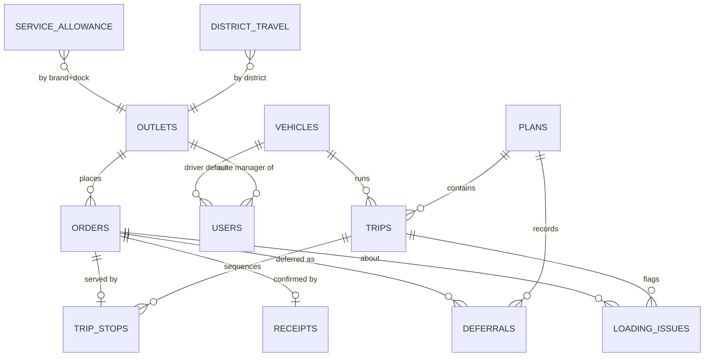

# Data model

Reference tables seeded from the shared CSVs: `outlets`, `vehicles`, `calendar_days`, `district_travel`, `service_allowance`.
Workflow tables: `users`, `orders`, `plans`, `trips`, `trip_stops` (carries outcome, POD photo, `client_uuid`, device `recorded_at`, `synced_at`, `conflict_note`), `deferrals` (reason code, text, unavoidable flag, decided_by, rescheduled date), `loading_issues`, `receipts`, `notifications`.

Order status flow: `confirmed → planned → loaded → in_transit → delivered | failed → received | issue`, or `deferred`.
